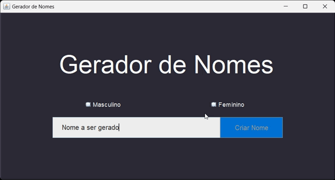

# 👪 Gerador de Nomes

Este projeto é um gerador de nomes aleatórios baseado em arquivos JSON contendo listas de nomes masculinos, nomes femininos e sobrenomes.

<br>



<br>

## Como usar

1. Configurar o arquivo JSON

    Antes de executar o programa, certifique-se que o arquivo JSON contenha listas de nomes masculinos, femininos e sobrenomes. O formato esperado do arquivo é o seguinte:

```json
{
    "nomes masculinos": ["Nome1", "Nome2", "Nome3", ...],
    "nomes femininos": ["Nome1", "Nome2", "Nome3", ...],
    "sobrenomes": ["Sobrenome1", "Sobrenome2", "Sobrenome3", ...]
}
```

2. Execução do Programa

    Compile todas as classes e execute a classe `Main`. 
    Certifique-se de que o caminho para o arquivo JSON está configurado corretamente na classe `LeitorNomesJson`.

3. Geração de Nomes

    Depois de executado o programa, você poderá gerar nomes aleatórios escolhendo um gênero e clicando em *Criar Nome*. Note que para gerar um nome, você precisa selecionar uma das opções.

## Obsevações 

- Certifique-se de que o arquivo JSON contendo as listas de nomes esteja corretamente formatado e acessível pelo programa.

- O método `gerarNome(String escolha)` retorna um nome aleatório a partir da escolha de gênero fornecida.

- A classe `NomesPessoas` inclui métodos para verificar se as listas de nomes são nulas ou vazias e para ler os nomes concatenados em um única string.

- Certifique-se de tratar as exceções adequadamente, especialmente durante a leitura do arquivo JSON.

# gerador-de-nomes
Este projeto visa o aprendizado de programação em Java.
